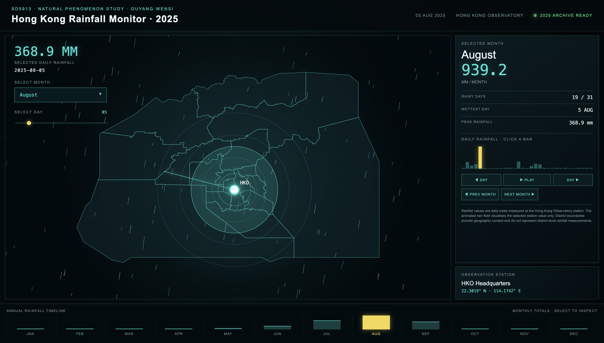

# Hong Kong Rainfall Monitor · 2025

**Interactive visualization of Hong Kong daily rainfall in 2025**

**Direct access to visualization:** https://whitter-oy.github.io/HK-rainfall-2025/

**Data source:** https://data.weather.gov.hk/weatherAPI/cis/csvfile/HKO/2025/daily_HKO_RF_2025.csv



## The phenomenon

This project explores daily rainfall in Hong Kong throughout 2025. Rainfall is a natural phenomenon that changes significantly across seasons and individual days. Some periods are almost completely dry, while summer months can contain sudden and extremely intense rainfall.

I chose rainfall because the difference between ordinary days and extreme weather can be difficult to understand from a table of numbers alone. My goal was to transform the data into an interactive visual experience where the viewer can explore both the yearly pattern and individual rainfall events.

## The source

The rainfall data comes from the **Hong Kong Observatory (HKO)**.

The committed CSV contains **365 daily records from 2025**. Each row represents one day and includes the year, month, day, daily total rainfall and data completeness. Rainfall is measured in **millimetres (mm)**.

The project also uses Hong Kong administrative district boundary data to provide geographic context for the interface. The district boundaries do not contain rainfall measurements.

## The final visualization

The final outcome is an interactive website called **Hong Kong Rainfall Monitor · 2025**.

The viewer can select a month and a specific day to inspect the rainfall recorded at the Hong Kong Observatory. The interface combines a Hong Kong district map, daily rainfall values, monthly rainfall totals, rainy-day counts, the wettest day, a daily bar chart and an annual rainfall timeline.

The rain animation is also driven by the real data. A day with heavier rainfall produces a stronger animated rain field and a more active visual response around the observation station. The Play control allows the viewer to move through the rainfall records over time.

## What the visualization shows

The visualization reveals the strong seasonal rhythm of rainfall in Hong Kong. The monthly timeline makes the difference between the relatively dry winter months and the much wetter summer period immediately visible.

Selecting individual days also reveals extreme events that can disappear inside a monthly total. For example, a single day with very heavy rainfall produces a noticeably different visual state from an ordinary or dry day.

## What the visualization hides

The rainfall measurements come from the **Hong Kong Observatory station**, not from all 18 districts. Therefore, the district map is used only as geographic context and does not imply different rainfall levels in different districts.

The project also reduces rainfall to daily totals. It does not show hourly variation, storm duration, wind, cloud movement or other meteorological variables. The visualization therefore focuses on rainfall intensity and change over time rather than providing a complete weather model.

## How to run

```bash
uv run fetch.py
uv run plot.py